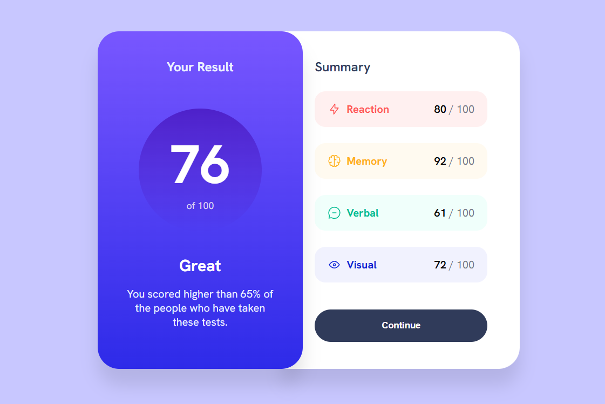

# Results Summary Component

A simple UI project built with Vue, focused on displaying a results summary and categorized scores.

## Overview

This project features a two-card layout:

* **Main card** showing the overall result
* **Summary card** listing categories with their respective scores

Data is loaded from a local JSON file.

## Technologies

* Vue 3
* CSS (Flexbox)
* JSON for static data

## Structure

* `src/data/data.json` → category data
* `style.css` → global styles

## Purpose

This project was created to practice:

* Rendering lists with `v-for`
* Working with JSON data
* Building layouts using Flexbox
* Basic responsive design

## Responsiveness

The layout adapts to smaller screens using media queries, stacking the cards vertically.

---

Built for learning and experimentation.
